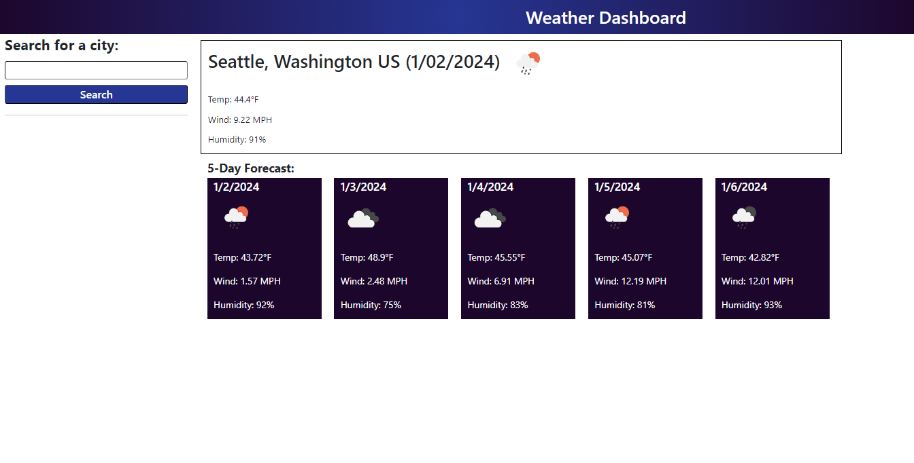
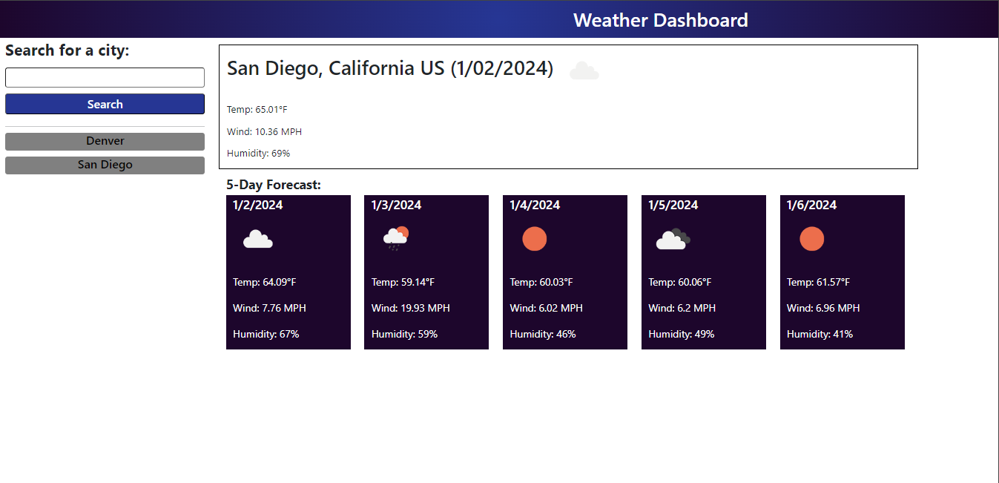
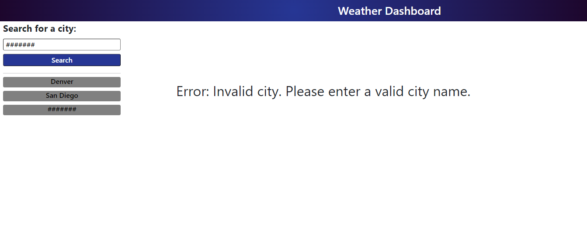

# Mod6-Weather-Dashboard

## Description
MSU Coding Bootcamp Module 6 Challenge: Weather Dashboard

The purpose behind this weather dashboard was to gain further experience working with 3rd party APIs. This projecet used 2 separate APIs from [openweathermap.org](http://www.openweathermap.org). I gained experience retrieving and manipulating data from APIs and also utlizing a sortable list from jQuery. 

Future enhancements to this site may include adding a map using Google Maps Javascript API, adding the a ability to select a specifiic state/country for typed city, and a adding button to clear the search results. Additionally, it would be helpful to make the landing page related to user's location rather than hard-coded to Seattle.

## Installation
[GitHub Repo](https://github.com/ECiarabellini/Mod6-Weather-Dashboard)
[GitHub Pages](https://eciarabellini.github.io/Mod6-Weather-Dashboard)

## Usage
Search for a city name using the search box. The name of the city will then appear in the search history on the left. Click and drag to reorder the list. Click on a city name in history to view weather for that city. In the 5-day  forecast, the temperature presented is the high temperature expected for that day, and the weather emoji, wind, and humidity are for the time of that high temperature. Today's date in the 5-day forecast is the high temperature expected in the remainder of the current day.

## Credits
I used ChatGPT for advice on nesting return fetch(fiveDayForecastURL) within in the geocodeURL fetch function to make them work sequentially rather than asynchoneously.
I also sourced the code to set the 5-day forecast date fields from chatGPT.

## License
MIT License